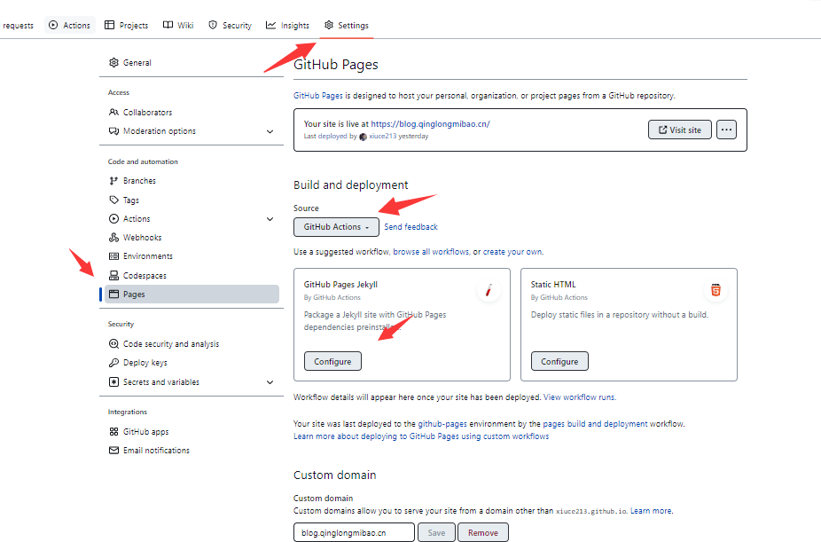

---
# 前言

之前捡漏一元买了一台华为云服务器，想着既然有服务器了，那么网站搭起来多少要有点内容吧，就开始学着搭博客，参考了很多大佬的博客，最后选择了hexo来作为自己的博客框架。目前能正常运行，那么就记录一下小白在搭博客中踩过的坑吧。

  


## 第一步准备本地环境

1.[node.js](https://nodejs.org/en/)下载，并安装。

2.[git](https://git-scm.com/)下载，并安装。

3.安装Hexo，在命令行运行一下命令

`
   npm install -g hexo-cli
`

4.初始化Hexo，在命令行依次运行一下命令即可：

以下，即存放Hexo初始化文件的路径， 即站点目录。

    hexo init folder
    cd folder
    npm install
    
新建完成后，在路径下，会产生这些文件和文件夹：

    
    ├── _config.yml 
    ├── package.json
    ├── scaffolds
    ├── source
    |   └── _posts
    └── themes
    

### 注释

-
    - hexo相关命令均在站点目录(以上命令出的就是folder文件夹)下，用命令行的运行
 
    - 站点配置文件：站点目录下的_config.yml。

    - 主题配置文件：站点目录下的themes文件夹下的，主题文件夹下的_config.yml

5.启动服务器。在站点目录(folder)输入以下命令，即可预览

```
hexo s
```
然后你就可以根据你终端显示的网址预览了

## 第二步：Github Pages

>GitHub Pages 是通过 GitHub 托管和发布的公共网页。 启动和运行的最快方法是使用 Jekyll 主题选择器加载预置主题。 然后，您可以修改 GitHub Pages 的内容和样式。

[Github Pages官方教程文档](https://docs.github.com/zh/pages/quickstart)
接下来是实际操作

1.创建[Github](https://github.com)账号

2.创建仓库， 仓库名为：(你的Github账号名称).github.io

3.添加SSH key到github
    -  如果是单项目使用就添加到项目的settings
    -  如果是多项目使用就添加到账号的settings
    -  注意添加到单项目的就不能添加到账号或者其他项目了

4.修改_config.yml（在站点目录下）。文件末尾修改为：

    # Deployment
    ## Docs: https://hexo.io/docs/one-command-deployment
    deploy:
      type: git
      repo: 你的ssh地址
      branch: main

注意：上面仓库地址写ssh地址，不写http地址。现在的github的主分支名是main
我看好多攻略还是习惯性用的master，虽然没啥影响，但是统一比较好看

5.将本地Hexo博客推送到GithubPages

- 安装hexo-deployer-git插件。在命令行（即Git Bash）运行以下命令即可：

      ` npm install hexo-deployer-git --save` 

-推送到GithubPages。在命令行（即Git Bash）依次输入以下命令，  
 返回INFO Deploy done: git即成功推送：

    hexo g
    hexo d

等待10分钟左右，浏览器访问网址： https://<Github账号名称>.github.io  
注意如果没有，请多等待一会，因为github page 本身要编译

## 第三步 github Action

推送之后我们来到github，到我们的setting页面,点击右侧的pages
选择github Actions然后点击GitHub Pages Jekyll



进入以后github已经帮你生成好内容了，不需要改动，点右上角的start commit就可以了
如果想要了解github Action的内容可以点击下面链接
[学会用githubActions](https://juejin.cn/post/7113562222852309023)

等链接显示出来再等待10分钟左右，浏览器访问网址： https://<Github账号名称>.github.io
就搭建好了

## 第四步 绑定域名（没有的可以跳过）

我们先打开您的域名服务商的网页选择你想要绑定的域名，选择管理解析，选择cname类型，绑定<Github账号名称>.github.io这个网址，保存

我们再返回到Github Pages页面找到Custom domain，填写我们刚刚想要绑定的域名点击save

这时我们再打开https://<Github账号名称>.github.io，就会自动跳转到绑定的域名了


## 主题选择

我们可以自己根据hexo提供的文档来编写页面，当然也可以选择别人写好的主题

#### 选择主题

我们可以访问hexo官方提供的[主题列表](https://hexo.io/themes/)来选择一个我们觉得适合的主题

#### 主题安装

您只需要将选择的主题的文件夹下载下来，找到我们的themes 文件夹，放在这个文件夹之内  
然后在站点目录(不是主题)的_config.yml找到theme改成我们主题文件夹的名称就可以了

安装之后记得使用 hexo clean命名先清理之前创建的public

#### 主题优化

##### 博文置顶

安装插件 npm install hexo-generator-index-pin-top --save

然后在需要置顶的文章的Front-matter中加上top即可：


> <font size=4 face="黑体">---
> title: 2018
> date: 2018-10-25 16:10:03
> top: 10
> ---</font>


## 常用操作

### 创建文章

命令：
`hexo new [layout] <title>`

参数说明：

-[layout]可以为以下三种：

| 参数名 | 功能                    | 文章路径       |
| ------ | ----------------------- | -------------- |
| post   | 新建博文                | source/_posts  |
| page   | 新建页面（如404，分类） | source         |
| draft  | 草稿                    | source/_drafts |

草稿可通过一下命令发布：

`$ hexo publish [layout] <title>`

- title注意：

不是博文标题，

是博文markdown文件的名字，

也是博文链接的后缀（如https://www.simon96.online/2018/10/12/hexo-tutorial/中的hexo-tutorial）

### 文章模版

- 创建模版
  
  在新建文章时，Hexo 会根据 scaffolds 文件夹内相对应的文件来建立文件，例如：

  `hexo new blog "simon"`

  在执行这行指令时，Hexo 会尝试在 scaffolds 文件夹中寻找 blog.md，并根据其内容建立文章。
- 修改参数

以下是您可以在模版中使用的变量：

| 变量   | 描述         |
| ------ | ------------ |
| layout | 布局         |
| title  | 标题         |
| date   | 文件建立日期 |

### Front-matter

就是博文最上方以 --- 分隔的那部分。

默认可以使用的Front-matter：

| 参数名     | 描述                 | 默认值       |
| ---------- | -------------------- | ------------ |
| layout     | 布局                 |              |
| title      | 标题                 |              |
| date       | 建立日期             | 文件建立日期 |
| updated    | 更新日期             | 文件更新日期 |
| comments   | 开启文章的评论功能   | true         |
| tags       | 标签（不适用于分页） |              |
| categories | 分类（不适用于分页） |              |
| permalink  | 覆盖文章网址         |              |


## 感谢阅读